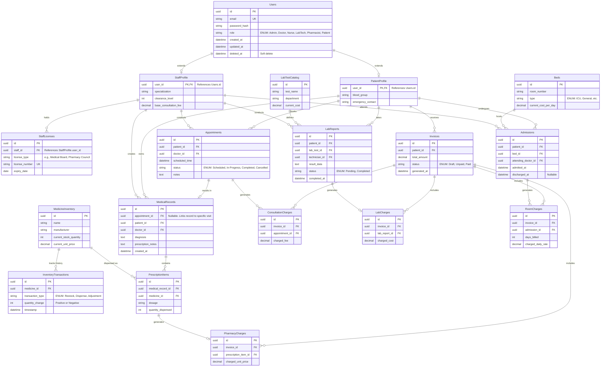

# Hospital Management System

###  **[Experience the Live Application Here](https://hospital-management-system-p427.onrender.com/)**

# CareFlow Enterprise: Hospital Management System

CareFlow is a role-based Hospital Management System (HMS) built with Django. It tackles race conditions, enforces strict financial ledgers, handles timezone-aware scheduling, and governs complex state transitions across multiple user roles—all while delivering a seamless UX for the hospital staff
---

## Project Overview

At its core, CareFlow simulates a living hospital workflow. When a patient books an appointment, the system enforces timezone-aware availability windows. When a doctor writes a prescription or orders lab work, the system locks that data and routes it directly to the pharmacist and lab technician queues. Every single action taken by any staff member is mathematically routed back to a strictly mapped, itemized financial ledger for the patient.

---

## Database Architecture & Entity-Relationship Diagram

The Entity-Relationship (ER) diagram below is rendered dynamically using Mermaid.js.

To handle the complex relationships between clinical actions and financial billing, the database is highly normalized. Notice how the base User model extends into specific profiles, and how the Inventory, Clinical, and Ward modules all route their foreign keys directly into centralized billing tables to enforce absolute billing accuracy.


---

## Technical Highlights


*   **ACID Transactions & Concurrency Locks:** I used Django's `transaction.atomic` and `select_for_update` in the pharmacy dispensing engine. This guarantees that if two pharmacists try to dispense the last remaining bottle of medication at the exact same millisecond, the database row is locked, preventing negative inventory balances.
*   **The Master Ledger Routing:** Initially, unpaid charges were floating and loosely attached to patients. I refactored the database schema to use centralized charge tables. Now, every department routes their specific foreign keys directly to the ledger, generating perfectly isolated, itemized financial records that cannot be duplicated.
*   **The Timezone Trap:** I implemented two-layer validation for appointment booking. The HTML frontend restricts date selection, but the backend parses the incoming strings into timezone-aware datetime objects and mathematically compares them against the server's atomic clock to prevent malicious API POST requests from booking past dates.
*   **Strict Clinical State Machines:** The backend is heavily fortified against edge cases. Doctors cannot double-admit a patient already in a bed, discharged patients cannot be re-discharged, and pharmacists are physically locked out of dispensing more or less medication than the doctor explicitly prescribed in the `PrescriptionItems` table.

---

## System Roles & Workflows

The system uses a custom User model segmented into distinct operational roles. If a user attempts to access a view outside their clearance, they are blocked by a custom role-based access control (RBAC) system.

*   **Patients:** Can book appointments within a strict 3-day rolling window and view itemized ledger entries.
*   **Doctors:** Manage the consultation room, diagnose, prescribe drugs, order lab tests, and admit/discharge patients to the inpatient ward.
*   **Pharmacists:** Monitor the prescription queue and securely dispense inventory.
*   **Lab Technicians:** Receive automated requisitions from the doctor, input bloodwork/test results, and clear the lab queue.

---

## What's Next(Future Improvements)

*   **Smart Symptom Checker:** Right now, patients just pick a doctor from a simple dropdown list. In the future, I want to add a text box where patients can just type how they are feeling (like "my head hurts"). The system would then read that and automatically suggest the best doctor for them, showing a match percentage.

*   **Live Updates for Staff:**: Currently, pharmacists and lab workers have to refresh their screens to see new orders. I want to add real-time updates so that as soon as a doctor prescribes medicine, it instantly pops up on the pharmacist's screen without them having to click refresh.

*   **Faster Background Tasks:** Things like making PDF bills or sending confirmation emails take time. Instead of making the user wait while the system does this, I want to move these tasks to the background. This will make the app feel much faster and smoother for the patient.
## Tech Stack

*   **Backend:** Python, Django, Django ORM
*   **Frontend:** HTML5, CSS3, Django Templates
*   **Documentation:** Mermaid.js (Diagram as Code)
*   **Database:** SQLite (Development) / PostgreSQL-ready (Production)
*   **Architecture:** MVT (Model-View-Template), Atomic Financial Ledgers

---

## How to Run Locally

**1. Clone the repository:**
```bash
git clone https://github.com/Abhi1517621/Hospital_Management_System
cd Hospital_Management_System
```

**2. Set up the virtual environment:**
```bash
python -m venv venv
source venv/bin/activate  # On Windows use: venv\Scripts\activate
```

**3. Install dependencies:**
```bash
pip install -r requirements.txt
```

**4. Run database migrations:**
```bash
python manage.py makemigrations
python manage.py migrate
```

**5. Create the master administrator:**
```bash
python manage.py createsuperuser
```

**6. Boot the server:**
```bash
python manage.py runserver
```

Navigate to `http://127.0.0.1:8000/` to see the smart routing homepage.
